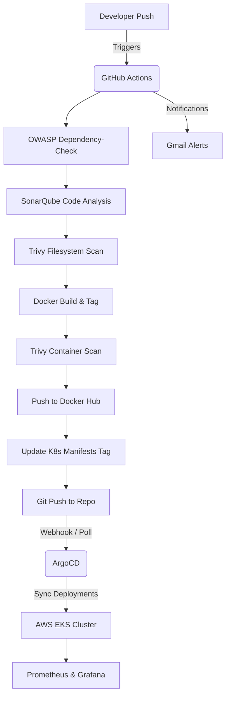
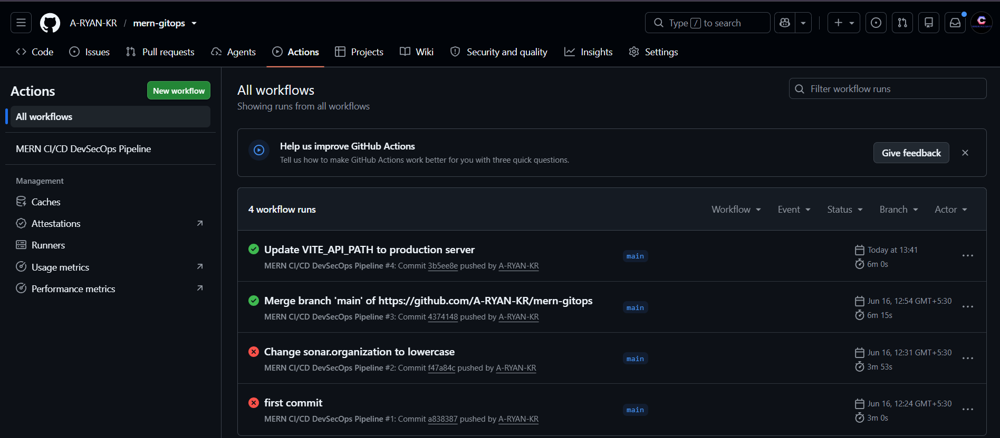
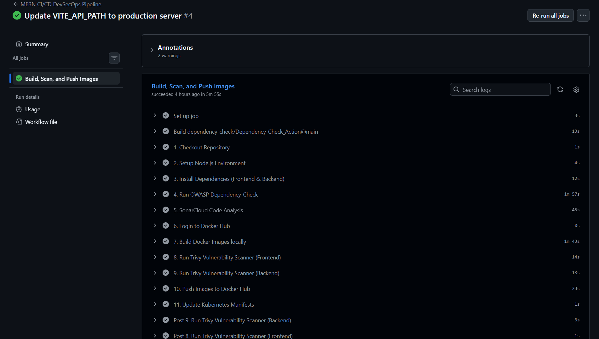
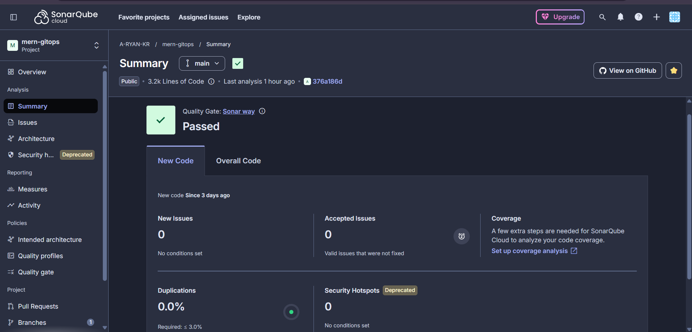
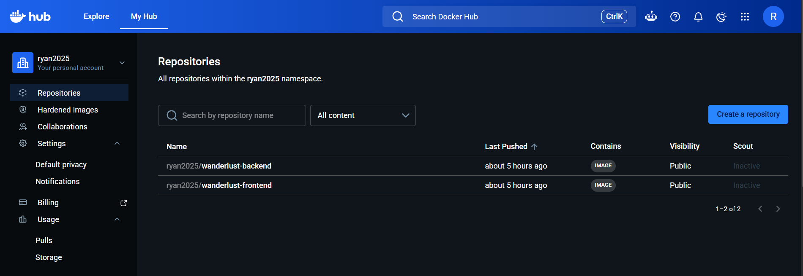
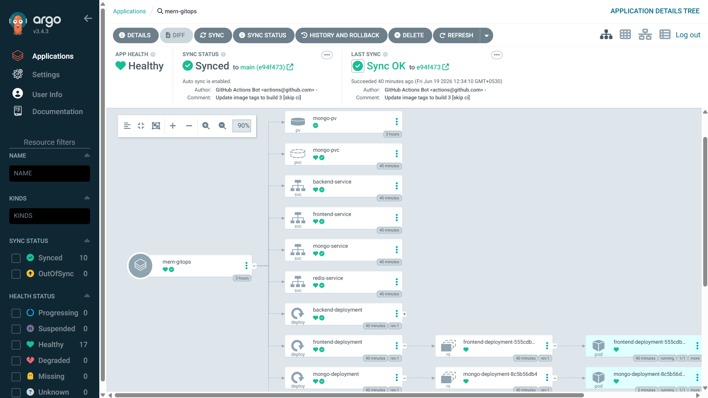
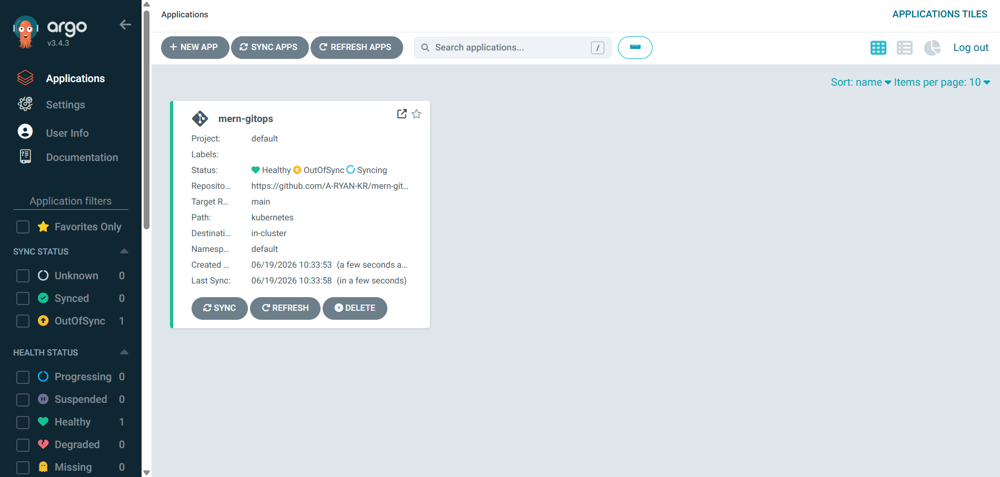
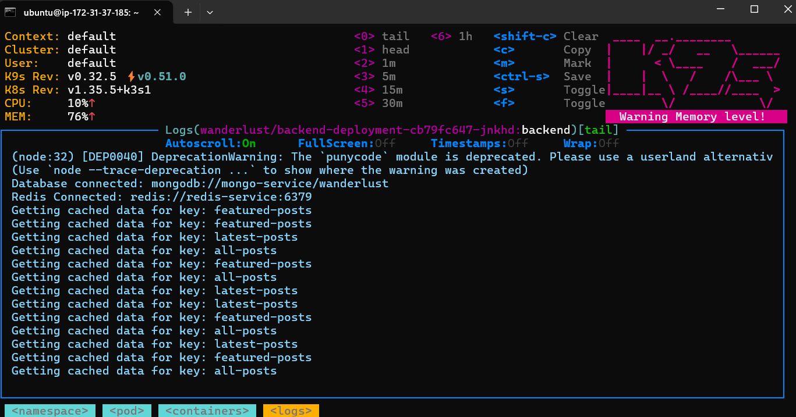
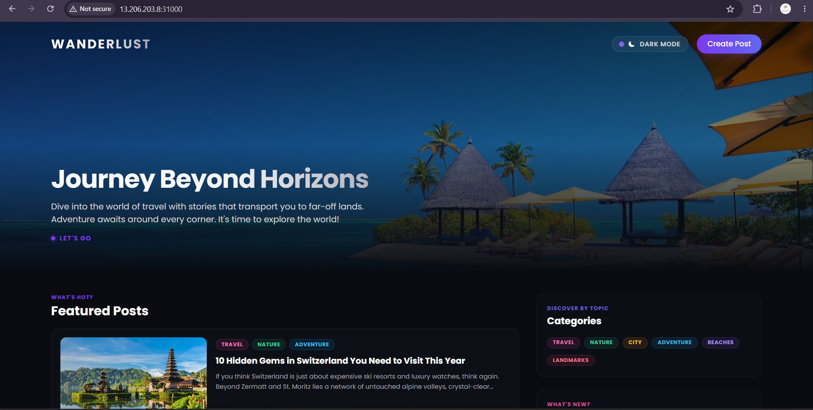

# Wanderlust - Ultimate DevSecOps Travel Blog 🌍✈️

Wanderlust is a production-grade, three-tier MERN stack travel blog application. This repository demonstrates a complete **modern DevSecOps CI/CD and GitOps delivery pipeline** using **GitHub Actions**, **ArgoCD**, and **Amazon EKS**.

---

## 🏗️ System Architecture & Pipeline Flow

This project implements a fully automated GitOps continuous integration and continuous deployment pipeline. Below is the end-to-end system architecture:


### 🔁 The Pipeline Lifecycle


---

## 🛠️ Tech Stack & DevSecOps Tools

| Category | Tool | Description |
| :--- | :--- | :--- |
| **Frontend** |  | Single Page Application built on React. |
| **Backend** |   | RESTful API built on Node.js/Express. |
| **Database & Cache** |   | Primary Database and caching layers. |
| **CI Orchestrator** |  | Automates build, test, and security scanning jobs. |
| **Security Scanning** |   | Scans for library vulnerabilities and container image issues. |
| **Code Quality** |  | Static Application Security Testing (SAST). |
| **GitOps CD** |  | Declares target state and auto-syncs with K8s. |
| **Orchestration** |  | Managed Kubernetes engine on AWS. |
| **Monitoring** |   | System monitoring, alerting, and metric dashboards via Helm. |
| **Notifications** |  | Instant email alerts on build states. |

---

## 🚀 Navigation & Setup Sections

> [!NOTE]  
> Follow these sections in sequence to deploy the complete architecture.

* [1. AWS Infrastructure Setup (EKS)](#1-aws-infrastructure-setup-eks)
* [2. SonarQube Server Deployment](#2-sonarqube-server-deployment)
* [3. GitHub Actions Secrets Configuration](#3-github-actions-secrets-configuration)
* [4. ArgoCD Installation & Configuration](#4-argocd-installation--configuration)
* [5. Prometheus & Grafana Monitoring Setup](#5-prometheus--grafana-monitoring-setup)
* [6. Gmail Notifications Configuration](#6-gmail-notifications-configuration)
* [7. Clean Up Instructions](#7-clean-up-instructions)
* [8. Showcase Gallery](#8-showcase-gallery)

---

## 1. AWS Infrastructure Setup (EKS)

Configure your CLI environment and provision a managed AWS EKS cluster.

### AWS CLI Configuration
Download and install the AWS CLI:
```bash
curl "https://awscli.amazonaws.com/awscli-exe-linux-x86_64.zip" -o "awscliv2.zip"
sudo apt install unzip -y
unzip awscliv2.zip
sudo ./aws/install
aws configure
```

### Install kubectl (Kubernetes CLI)
```bash
curl -LO "https://dl.k8s.io/release/$(curl -L -s https://dl.k8s.io/release/stable.txt)/bin/linux/amd64/kubectl"
chmod +x ./kubectl
sudo mv ./kubectl /usr/local/bin/
kubectl version --client
```

### Install eksctl (EKS Provisioning CLI)
```bash
curl --silent --location "https://github.com/weaveworks/eksctl/releases/latest/download/eksctl_$(uname -s)_amd64.tar.gz" | tar xz -C /tmp
sudo mv /tmp/eksctl /usr/local/bin
eksctl version
```

### Provision AWS EKS Cluster
Execute these commands to bootstrap the cluster. Note that nodegroups will launch with `t2.large` nodes to handle database, caching, frontend, backend, and monitoring pods.
```bash
# 1. Create EKS Control Plane
eksctl create cluster --name=wanderlust \
                      --region=us-west-1 \
                      --version=1.30 \
                      --without-nodegroup

# 2. Associate IAM OIDC Provider for Service Accounts
eksctl utils associate-iam-oidc-provider \
    --region us-west-1 \
    --cluster wanderlust \
    --approve

# 3. Create Node Group
eksctl create nodegroup --cluster=wanderlust \
                       --region=us-west-1 \
                       --name=wanderlust-nodes \
                       --node-type=t2.large \
                       --nodes=2 \
                       --nodes-min=2 \
                       --nodes-max=3 \
                       --node-volume-size=30 \
                       --asg-access \
                       --external-dns-access
```

---

## 2. SonarQube Server Deployment

You can host SonarQube as a Docker container on an EC2 instance or run it on a cloud instance.

To launch a SonarQube server locally or on your master instance:
```bash
docker run -d --name SonarQube-Server -p 9000:9000 -d sonarqube:lts-community
```
Access the server at `http://<your-ip>:9000`. Navigate to **Administration ➔ Security ➔ Users ➔ Tokens** to generate a token for authentication in the GitHub Action.

---

## 3. GitHub Actions Secrets Configuration

To run the CI/CD pipeline, the GitHub repository needs specific secrets configured under **Settings ➔ Secrets and Variables ➔ Actions**.

Ensure you define the following secrets:

| Secret Name | Description | Example |
| :--- | :--- | :--- |
| `DOCKER_USERNAME` | Docker Hub username. | `yourusername` |
| `DOCKER_PASSWORD` | Docker Hub password/access token. | `dckr_pat_...` |
| `SONAR_TOKEN` | Generated token from your SonarCloud/SonarQube account. | `sqa_...` |
| `MAIL_USERNAME` | Gmail account used to send build status alerts. | `your-email@gmail.com` |
| `MAIL_PASSWORD` | Generated Gmail App Password. | `xxxx xxxx xxxx xxxx` |
| `MAIL_TO` | Target recipient email address. | `recipient@gmail.com` |

---

## 4. ArgoCD Installation & Configuration

Deploy ArgoCD onto the newly provisioned Kubernetes cluster for declarative CD.

### Install ArgoCD Server
```bash
# Create namespace
kubectl create namespace argocd

# Apply installation manifest
kubectl apply -n argocd -f https://raw.githubusercontent.com/argoproj/argo-cd/stable/manifests/install.yaml

# Monitor deployment progress
kubectl get pods -n argocd --watch
```

### Expose ArgoCD Server UI via NodePort
```bash
kubectl patch svc argocd-server -n argocd -p '{"spec": {"type": "NodePort"}}'
```
Locate the NodePort assigned:
```bash
kubectl get svc argocd-server -n argocd
```

### Retrieve Initial Admin Password
```bash
kubectl -n argocd get secret argocd-initial-admin-secret -o jsonpath="{.data.password}" | base64 -d; echo
```
Log in via your browser using the username `admin` and the retrieved password. We recommend updating your password immediately under user configuration.

### Register EKS Cluster in ArgoCD CLI
Install the ArgoCD CLI tool:
```bash
sudo curl --silent --location -o /usr/local/bin/argocd https://github.com/argoproj/argo-cd/releases/download/v2.4.7/argocd-linux-amd64
sudo chmod +x /usr/local/bin/argocd

# Login to your ArgoCD Server
argocd login <node-ip>:<node-port> --username admin

# Add Cluster context
argocd cluster add $(kubectl config current-context) --name wanderlust-cluster
```

---

## 5. Prometheus & Grafana Monitoring Setup

Deploy the Prometheus operator stack via Helm to collect logs and visualize cluster resources.

### Install Helm Package Manager
```bash
curl -fsSL -o get_helm.sh https://raw.githubusercontent.com/helm/helm/main/scripts/get-helm-3
chmod 700 get_helm.sh
./get_helm.sh
```

### Configure Prometheus Community Repository & Namespace
```bash
helm repo add prometheus-community https://prometheus-community.github.io/helm-charts
helm repo update
kubectl create namespace prometheus
```

### Install Monitoring Stack
```bash
helm install prometheus-stack prometheus-community/kube-prometheus-stack -n prometheus
```

### Expose Dashboards via NodePort
Expose the Prometheus and Grafana dashboards to clean, accessible ports on your node:
```bash
kubectl patch svc prometheus-stack-kube-prom-prometheus -n prometheus -p '{"spec": {"type": "NodePort"}}'
kubectl patch svc prometheus-stack-grafana -n prometheus -p '{"spec": {"type": "NodePort"}}'
```

### Get Grafana Admin Password
```bash
kubectl get secret --namespace prometheus prometheus-stack-grafana -o jsonpath="{.data.admin-password}" | base64 --decode ; echo
```
Access Grafana in the browser at `http://<node-ip>:<grafana-nodeport>` using username `admin` and the decoded password.

---

## 6. Gmail Notifications Configuration

Configure GitHub Actions to send detailed pipeline alerts to your inbox on every build.

### 🔑 Set Up Gmail App Password
1. Navigate to your Google Account Settings.
2. Turn on **2-Step Verification** (Mandatory).
3. Search for **App Passwords**.
4. Generate a new App Password with a custom name like `GitHub Actions Wanderlust`.
5. Copy the generated 16-character password and save it as `MAIL_PASSWORD` in your GitHub repository Secrets.

### 📝 Integration in GitHub Actions Workflow
In your `.github/workflows/ci.yml` pipeline, add the notification step to email results on failure or success:
```yaml
      # Email Notification Step
      - name: Send Email Notification
        uses: dawidd6/action-send-mail@v3
        if: always() # Trigger notifications on all outcomes
        with:
          server_address: smtp.gmail.com
          server_port: 465
          username: ${{ secrets.MAIL_USERNAME }}
          password: ${{ secrets.MAIL_PASSWORD }}
          subject: 'Wanderlust Build Report: ${{ job.status }}'
          to: ${{ secrets.MAIL_TO }}
          from: 'Wanderlust CI/CD Workflow'
          body: |
            Wanderlust CI/CD pipeline run finished with status: ${{ job.status }}.
            
            - Commit: ${{ github.sha }}
            - Actor: ${{ github.actor }}
            - Workflow Run Details: https://github.com/${{ github.repository }}/actions/runs/${{ github.run_id }}
```

---

## 7. Clean Up Instructions

To avoid unexpected charges, terminate all provisioned AWS cloud resources once testing is complete:

```bash
# Terminate nodegroups and control plane
eksctl delete cluster --name=wanderlust --region=us-west-1
```

---

## 8. Showcase Gallery

Here is a visual breakdown of the running components, security analysis, and GitOps deployments:

### 🚀 CI Pipeline - GitHub Actions
The multi-job DevSecOps pipeline builds and checks code quality, containerizes the app, performs scanning, pushes to Docker Hub, and triggers the GitOps bridge:



### 🛡️ Static Application Security Testing (SonarQube)
Full code-quality audit with code coverage, code smells, bugs, and vulnerability ratings:


### 📦 Container Registry (Docker Hub)
Build artifacts successfully tagged and stored in Docker Hub registry:


### 🔄 GitOps Synchronization (ArgoCD)
ArgoCD continuously reconciling manifest states, mapping deployment and service entities onto Kubernetes:



### 🖥️ Cluster Management (K9s Terminal)
Kubernetes pods, services, and configs monitored via the K9s CLI terminal dashboard:


### 🌍 Deployed Application
The Wanderlust three-tier application deployed and fully accessible online:

